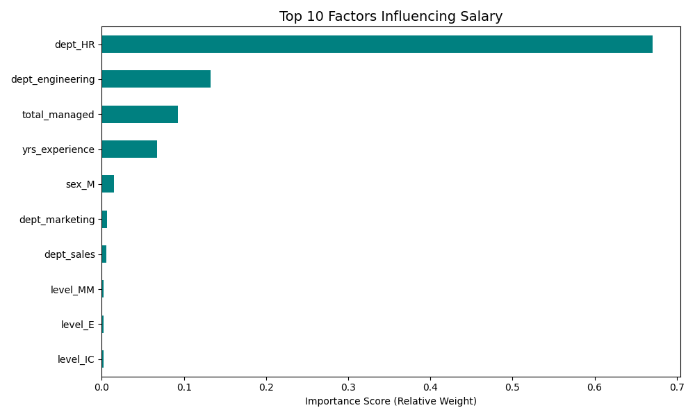
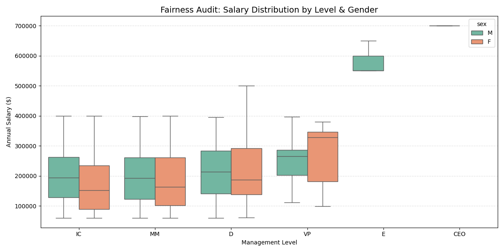
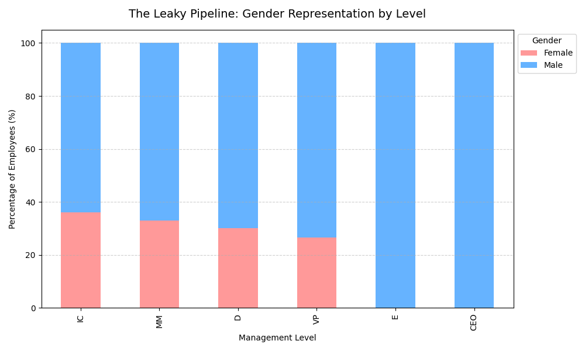
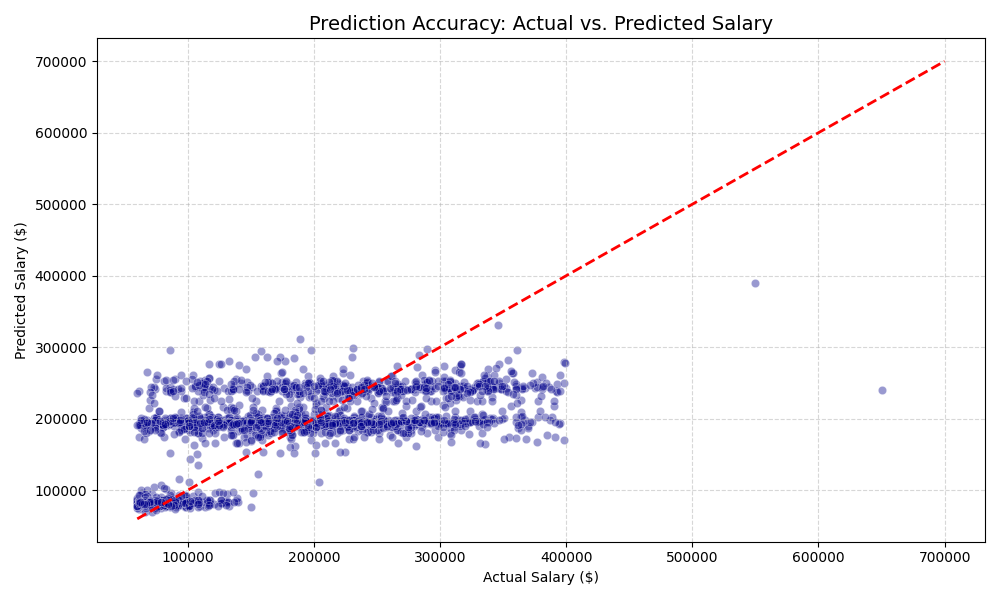

# Workplace Diversity Analysis

## 📌 Project Overview

This project investigates internal employee data for a tech organization (10,000 employees) to identify systemic biases in compensation and representation. By engineering an organizational hierarchy from raw reporting data, the analysis distinguishes between Direct Pay Bias (unequal pay for equal work) and Systemic Representation Bias (the "Leaky Pipeline").

## 🛠️ Technical Stack

Data Engineering: Python (Pandas, NumPy)

Graph Theory: NetworkX (used for recursive hierarchy mapping)

Machine Learning: Scikit-Learn (Random Forest Regressor for salary prediction)

Visualization: Seaborn, Matplotlib

## 🧬 Key Data Engineering: 

The Graph ApproachUnlike standard flat-file analysis, this project treats the company as a Directed Acyclic Graph (DAG).

*Recursive Levels*: Classified 10,000 employees into 6 tiers (IC, MM, Director, VP, Executive, CEO) by calculating the shortest path length from the CEO.

*Management Span*: Calculated "Total People Managed" (direct + indirect reports) using graph traversal, identifying this as the #1 driver of compensation.

## 📊 Business Insights & Findings

The "Leaky Pipeline": Female representation is strongest at the entry-level (36%) but drops to 25% at the Executive level, suggesting a barrier to promotion rather than a lack of talent.

### Fairness Audit: 

*Raw Gender Pay Gap*: 13.89%.

*Adjusted Gender Pay Gap*: ~0% ($p=0.656$).

*Conclusion*: The company pays equitably for the same role, but the overall gap is driven by a lack of gender diversity in high-paying Engineering roles and Executive tiers.

*Salary Drivers*: Management span and Departmental allocation are the primary determinants of pay, while Degree Level and Signing Bonuses showed no statistical significance.

### 🚀 Recommendations 

*Standardize Promotions*: Implement objective scorecards for Director+ roles to address the 11% drop in female representation at leadership tiers. 

*Audit Resource Allocation*: Ensure high-potential female managers are assigned teams of equal size and impact, as "Total Managed" is the primary driver of salary growth.

*Technical Recruiting*: Focus DEI efforts on the Engineering department to close the raw salary gap, as it carries the highest departmental pay premium.

## Salary Prediction

[Salary Prediction CSV](final_salary_predictions.csv) contains all employees actual salary and predicted salary using Random forest Regressor.

## Graphs

